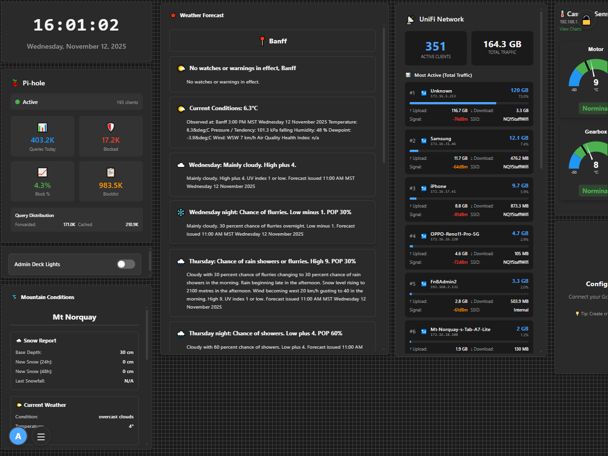
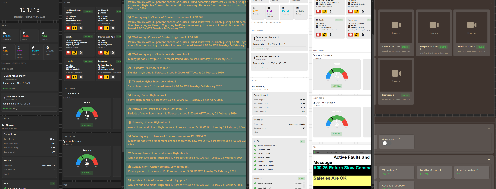

# stealthDash

A minimalist web dashboard with draggable, resizable widgets. Built with TypeScript, featuring zero-chrome UI, multi-user authentication, and 21 widget types.



## Features

- **Zero-Chrome UI** — No sidebars or menus, just floating controls and a slide-out hamburger panel
- **21 Widget Types** — Text, Image, Weather, ChatGPT, Clock, Docker, VNC, Gmail, and more
- **Multi-Dashboard** — Create, rename, reorder, and switch between multiple dashboards per user
- **Public Sharing** — Share dashboards via link for anonymous read-only viewing
- **Multi-User Auth** — Secure login, registration, password recovery, and admin management
- **13 Themes** — Light, Dark, Gruvbox, Tokyo Night, Catppuccin, Forest, Sunset, Peachy, Stealth, Tactical, Futurist, Retro, and System (auto)
- **Drag & Resize** — Intuitive controls with grid snapping and visual snap guides
- **Cross-Tab Sync** — Real-time sync across browser tabs via BroadcastChannel, plus server polling for cross-browser sync
- **Undo/Redo** — Full history management for widget changes
- **Keyboard Navigation** — Comprehensive keyboard shortcuts for all operations
- **Auto-Save** — Debounced server-side persistence with PostgreSQL
- **Credential Vault** — Encrypted (AES) storage for API keys, passwords, and tokens
- **Network Monitoring** — Real-time ICMP ping tracking with latency graphs
- **Lock Mode** — Prevent accidental edits by locking the canvas

## Quick Start

### Prerequisites

- Docker and Docker Compose
- Git

### Installation

1. **Clone the repository**
   ```bash
   git clone https://github.com/fideltfg/stealthDash.git
   cd stealthDash/Dashboard
   ```

2. **Configure environment**
   ```bash
   cp .env.example .env
   # Edit .env with your settings (optional for basic setup)
   ```

3. **Start the application**
   ```bash
   docker compose up -d
   ```

4. **Access the dashboard**
   - Open [http://localhost:3000](http://localhost:3000)
   - Register your first user account
   - Start adding widgets!

### First User Setup

The first registered user needs admin privileges:

```bash
docker exec -i dashboard-postgres psql -U dashboard -d dashboard -c \
  "UPDATE users SET is_admin = true WHERE id = 1;"
```

## Usage Guide

### Authentication

**Register**
- Click "Register" on the login screen
- Enter username, email, and password
- Log in with your credentials

**Login**
- Enter username and password
- Your dashboard loads with your saved layout

**Password Recovery**
- Click "Forgot Password?" on the login screen
- Enter your email to receive a reset link
- Requires SMTP configuration in `.env` (falls back to logging the token if SMTP is not configured)

### Managing Dashboards

**Switch Dashboards**
- Use the dashboard switcher in the top-left corner
- Click the dropdown or use the navigation arrows

**Dashboard Manager**
- Open the dashboard manager to create, rename, delete, and reorder dashboards
- Each browser tab tracks its own active dashboard independently

**Share a Dashboard Publicly**
- Toggle a dashboard's public flag to generate a shareable URL (`#/public/<id>`)
- Public dashboards are read-only and require no authentication

### Managing Widgets

**Add Widget**
1. Click the **+** button (bottom-right)
2. Select a widget type from the list
3. Configure widget settings
4. The widget appears on your canvas

**Move Widget**
- **Mouse**: Drag anywhere on the widget
- **Keyboard**: Select widget, use arrow keys (`Shift+Arrow` for 10x speed)
- **Spacebar Pan**: Hold spacebar and drag to pan the canvas

**Resize Widget**
- **Mouse**: Drag resize handles (corners/edges appear on hover)
- **Keyboard**: Select widget, `Alt+Arrow` keys

**Configure Widget**
- Click the settings icon on the widget header
- Each widget type has unique configuration options
- Changes save automatically

**Delete Widget**
- Click the X button on the widget header

### Keyboard Shortcuts

| Shortcut | Action |
|----------|--------|
| `Cmd/Ctrl + Z` | Undo last change |
| `Cmd/Ctrl + Shift + Z` | Redo |
| `Arrow Keys` | Move selected widget |
| `Shift + Arrow` | Move widget 10x faster |
| `Alt + Arrow` | Resize selected widget |
| `Escape` | Deselect widget |
| `Spacebar` (hold) | Pan mode — drag to scroll canvas |
| `Tab` | Navigate UI controls |

### Themes & Backgrounds



**Change Theme**
- Open the theme picker from the hamburger menu (bottom-left)
- Choose from 13 themes: Light, Dark, Gruvbox, Tokyo Night, Catppuccin, Forest, Sunset, Peachy, Stealth, Tactical, Futurist, Retro, or System (follows OS preference)

**Change Background**
- Click the background toggle in the menu
- Cycles through: Grid, Dots, Lines, Solid

**Lock Dashboard**
- Click the lock button (top-right)
- Prevents accidental widget changes and hides edit controls

**Fullscreen**
- Toggle fullscreen mode from the menu

### Credential Management

Many widgets require API keys or credentials. Store them securely in the encrypted credential vault:

1. Click the user menu (bottom-left avatar)
2. Select "Manage Credentials"
3. Add a credential with a name, type, and value
4. Reference credentials in widget settings

**Supported Credential Types:**
- API Keys (ChatGPT, Weather, etc.)
- UniFi Controller credentials
- Home Assistant tokens
- Pi-hole API keys
- Docker host connections (with TLS client certificates)
- VNC server passwords
- Google Calendar API keys
- SNMP community strings
- Modbus connection details
- Custom credentials

## Available Widgets

### Core Widgets

| Widget | Description |
|--------|-------------|
| **Text** | Markdown editor with real-time preview, auto-save, and transparent background |
| **Image** | Display images from URL with contain/cover fit modes and alt text |
| **Embed** | Sandboxed iframe for external websites with click-to-activate |

### Time Widgets

| Widget | Description |
|--------|-------------|
| **Clock** | Analog or digital display with 12h/24h format, seconds, and date options |
| **Timezones** | Multiple timezone clocks — add and remove cities with real-time updates |

### Monitoring Widgets

| Widget | Description |
|--------|-------------|
| **Uptime Monitor** | ICMP ping monitoring with latency graphs, history, and success/failure stats |
| **Docker** | Monitor and manage Docker containers — start, stop, restart, and view logs |
| **Pi-hole** | DNS blocking statistics and query metrics from your Pi-hole instance |

### Network & IoT Widgets

| Widget | Description |
|--------|-------------|
| **UniFi** | Network device status and client connections from UniFi Controller |
| **UniFi Protect** | Live camera snapshots and motion detection from UniFi Protect |
| **UniFi Sensors** | Temperature, humidity, and light data from USL-Environmental devices |
| **Home Assistant** | Display entity states and call services on your Home Assistant instance |
| **Comet P8541** | Temperature, humidity, and pressure from Comet P8541 sensors via Modbus |

### Communication Widgets

| Widget | Description |
|--------|-------------|
| **ChatGPT** | Interactive conversation widget powered by the OpenAI API |
| **Gmail** | Inbox display with unread messages and quick actions via Google API |
| **RSS Feed** | Display RSS/Atom feed items with configurable refresh interval |

### Weather Widgets

| Widget | Description |
|--------|-------------|
| **Weather** | Current conditions and forecast (requires weather API key) |
| **Environment Canada** | Canadian weather data and alerts — no API key required |

### Utility Widgets

| Widget | Description |
|--------|-------------|
| **Google Calendar** | View upcoming events from Google Calendar |
| **MTN XML** | Parse and display XML data with customizable queries |
| **VNC Remote Desktop** | Connect to remote VNC servers with full keyboard/mouse interaction |

See [WIDGETS.md](./WIDGETS.md) for detailed widget configuration guides.

## Administration

### Admin Dashboard

Admins have access to user management with statistics and controls:

1. Click the user menu (bottom-left)
2. Select "Admin Dashboard" (only visible to admins)

**Admin Functions:**
- View statistics — total users, active dashboards, administrator count
- View all registered users in a management table
- Create new user accounts
- Promote or demote admin status
- Reset user passwords
- Delete user accounts and their dashboards

### Making Users Admin

**Via Database:**
```bash
docker exec -i dashboard-postgres psql -U dashboard -d dashboard -c \
  "UPDATE users SET is_admin = true WHERE username = 'username';"
```

**Via Admin UI:**
1. Log in as an admin
2. Open the Admin Dashboard
3. Find the user in the list
4. Click "Make Admin"

### User Settings

Users can manage their own accounts:
- Update email address
- Change password (requires current password)
- View account information (user ID, creation date, role)

## Docker Commands

### Development

```bash
# Start all services
docker compose up -d

# View logs
docker compose logs -f

# Rebuild after code changes
docker compose up --build -d

# Stop services
docker compose down

# Reset database (destroys all data)
docker compose down -v
docker compose up -d
```

### Production

```bash
# Build and start
docker compose -f docker-compose.prod.yml up -d

# View logs
docker compose -f docker-compose.prod.yml logs -f

# Stop
docker compose -f docker-compose.prod.yml down
```

### Makefile Commands

```bash
make dev          # Start development server
make dev-d        # Start development server (background)
make prod         # Start production server
make logs         # View logs
make down         # Stop all containers
make clean        # Clean up Docker resources
make rebuild      # Rebuild development without cache
make rebuild-prod # Rebuild production without cache
make shell        # Open shell in development container
make ps           # Show running containers
make help         # Show all available commands
```

## Configuration

### Environment Variables

Edit `.env` for custom configuration:

```bash
# Database
POSTGRES_USER=dashboard
POSTGRES_PASSWORD=your-secure-password
POSTGRES_DB=dashboard

# Security
JWT_SECRET=your-secret-key-change-this

# Email (for password recovery)
SMTP_HOST=smtp.gmail.com
SMTP_PORT=587
SMTP_USER=your-email@gmail.com
SMTP_PASS=your-app-password
EMAIL_FROM=Dashboard <noreply@yourdomain.com>
DASHBOARD_URL=http://localhost:3000

# Server
VITE_ALLOWED_HOSTS=localhost,.local
```

### Email Setup for Password Recovery

**Gmail:**
1. Enable 2-Factor Authentication
2. Generate an App Password at [myaccount.google.com/apppasswords](https://myaccount.google.com/apppasswords)
3. Use the App Password as `SMTP_PASS`

**Other Providers:**
See `.env.example` for Office 365, Outlook, and Yahoo configurations.

If SMTP is not configured, the server will log password-reset tokens to the console as a fallback.

### Port Configuration

Edit `docker-compose.yml` to change ports:

```yaml
services:
  dashboard:
    ports:
      - "3000:3000"   # Change 3000 to desired port

  ping-server:
    ports:
      - "3001:3001"   # Change 3001 to desired port
```

## Project Structure

```
Dashboard/
├── src/
│   ├── main.ts                    # Application entry point (Dashboard class)
│   ├── themes.ts                  # Theme registry (13 themes)
│   ├── widgetMetadata.ts          # Widget metadata for the add-widget menu
│   ├── components/
│   │   ├── AdminDashboardUI.ts    # Admin user management panel
│   │   ├── AuthUI.ts              # Login / registration UI
│   │   ├── CredentialsUI.ts       # Credential vault management
│   │   ├── PasswordRecoveryUI.ts  # Password reset flow
│   │   ├── UserSettingsUI.ts      # User profile & settings
│   │   ├── history.ts             # Undo/redo history manager
│   │   └── storage.ts             # Default state & UUID generation
│   ├── css/
│   │   └── app.css                # Global styles, themes, backgrounds
│   ├── services/
│   │   ├── auth.ts                # Authentication service (JWT)
│   │   ├── credentials.ts         # Credential vault API client
│   │   ├── dashboardStorage.ts    # Multi-dashboard persistence API
│   │   └── dashboardSync.ts       # Cross-tab & cross-browser sync
│   ├── types/
│   │   ├── base-widget.ts         # Widget lifecycle & cleanup
│   │   ├── types.ts               # Core TypeScript type definitions
│   │   ├── widget.ts              # Widget DOM creation & manipulation
│   │   └── widget-loader.ts       # Dynamic widget module loader
│   ├── utils/
│   │   ├── api.ts                 # API base URL & fetch helpers
│   │   ├── credentials.ts         # Credential resolution utilities
│   │   ├── dom.ts                 # DOM manipulation helpers
│   │   ├── formatting.ts          # Number & date formatting
│   │   ├── polling.ts             # Polling interval manager
│   │   ├── sanitizeWidgets.ts     # Strip secrets before persistence
│   │   └── widgetRendering.ts     # Shared widget rendering utilities
│   └── widgets/                   # Widget implementations (one file per type)
│       ├── chatgpt.ts
│       ├── clock.ts
│       ├── comet-p8541.ts
│       ├── docker.ts
│       ├── embed.ts
│       ├── envcanada.ts
│       ├── gmail.ts
│       ├── google-calendar.ts
│       ├── home-assistant.ts
│       ├── image.ts
│       ├── mtnxml.ts
│       ├── pihole.ts
│       ├── rss.ts
│       ├── text.ts
│       ├── timezones.ts
│       ├── unifi.ts
│       ├── unifi-protect.ts
│       ├── unifi-sensor.ts
│       ├── uptime.ts
│       ├── vnc.ts
│       └── weather.ts
├── ping-server/                   # Backend API server (Node.js / Express)
│   ├── src/
│   │   ├── server.js              # Express server & middleware
│   │   ├── auth.js                # JWT authentication middleware
│   │   ├── crypto-utils.js        # AES encryption for credentials
│   │   ├── db.js                  # PostgreSQL connection pool
│   │   ├── transform.js           # Data transformation utilities
│   │   └── vnc-proxy.js           # WebSocket VNC proxy (websockify)
│   ├── routes/
│   │   ├── admin.js               # Admin user management endpoints
│   │   ├── auth.js                # Login, register, password recovery
│   │   ├── credentials.js         # Encrypted credential CRUD
│   │   ├── dashboard.js           # Dashboard save/load/delete/public
│   │   ├── docker.js              # Docker container management proxy
│   │   ├── user.js                # User profile endpoints
│   │   └── widgets.js             # Widget proxy APIs (ping, SNMP, Modbus, etc.)
│   └── init-db.sql                # Database schema initialization
├── http/
│   └── index.html                 # HTML entry point
├── docs/                          # Documentation
├── docker-compose.yml             # Development Docker setup
├── docker-compose.prod.yml        # Production Docker setup
├── Dockerfile                     # Development container
├── Dockerfile.prod                # Production container (multi-stage, Nginx)
├── Makefile                       # Build & management shortcuts
├── nginx.conf                     # Production Nginx configuration
├── vite.config.ts                 # Vite bundler configuration
└── tsconfig.json                  # TypeScript configuration
```

## Technology Stack

- **Frontend**: TypeScript, Vite, Vanilla JS (no framework)
- **Backend**: Node.js, Express
- **Database**: PostgreSQL 15 (Alpine)
- **Libraries**: D3.js (graphs), JustGage (gauges), Marked (markdown), noVNC (remote desktop)
- **Auth**: JWT tokens, bcrypt password hashing
- **Encryption**: AES for credential storage at rest
- **Sync**: BroadcastChannel API (cross-tab), server polling (cross-browser)
- **Protocols**: ICMP ping, SNMP, Modbus TCP, WebSocket (VNC proxy)
- **Container**: Docker & Docker Compose
- **Production**: Multi-stage build with Nginx for static serving

## Troubleshooting

### Port Already in Use

Change ports in `docker-compose.yml` or stop conflicting services:
```bash
lsof -i :3000
# or
netstat -tuln | grep 3000
```

### Can't Login / Auth Issues

```bash
# Check ping-server logs
docker logs dashboard-ping-server --tail 50

# Verify database connection
docker exec -it dashboard-postgres psql -U dashboard -d dashboard \
  -c "SELECT COUNT(*) FROM users;"
```

### Database Connection Failed

```bash
# Check PostgreSQL is running
docker ps | grep postgres

# View database logs
docker logs dashboard-postgres

# Reset database
docker compose down -v
docker compose up -d
```

### Widget Not Loading

1. Check the browser console (F12) for errors
2. Verify required credentials are configured in the credential vault
3. Check that the ping-server is running and accessible

### Email Not Sending

1. Verify SMTP credentials in `.env`
2. Check ping-server logs: `docker logs dashboard-ping-server`
3. If SMTP is not configured, the reset token is logged to the server console

### Sync Conflict

If a "Dashboard out of sync" banner appears:
- Click "Reload Dashboard" to pull the latest version from the server
- This occurs when the same dashboard is edited in another tab or browser

## Security Considerations

- **Change default passwords** in `.env` file
- **Use a strong JWT_SECRET** (32+ random characters)
- **Enable HTTPS** in production (use a reverse proxy like Nginx or Traefik)
- **Regular backups** of PostgreSQL data
- **Keep dependencies updated**: `npm audit` and `docker pull`
- **Limit admin accounts** to trusted users only
- **Use the credential vault** instead of hardcoding API keys in widgets
- **Credentials are AES-encrypted** at rest in the database

## Deployment

For production deployment:

1. Use `docker-compose.prod.yml`
2. Configure a reverse proxy (Nginx/Traefik) with SSL
3. Set secure environment variables
4. Enable firewall rules
5. Set up automated backups
6. Monitor logs regularly

See [DEPLOYMENT.md](./DEPLOYMENT.md) for a detailed production deployment guide.

## Development

### Local Development (without Docker)

```bash
# Install dependencies
npm install

# Start Vite development server
npm run dev

# In a separate terminal, start the ping-server
cd ping-server
npm install
node src/server.js
```

### Adding New Widgets

1. Create a widget file in `src/widgets/your-widget.ts`
2. Implement the widget renderer interface
3. Add widget metadata to `src/widgetMetadata.ts`

See existing widgets for examples and [WIDGETS.md](./WIDGETS.md) for the development guide.

## Browser Support

Modern browsers with ES2020 support:
- Chrome / Edge 90+
- Firefox 88+
- Safari 14+

## License

MIT License — see LICENSE file for details.

## Contributing

1. Fork the repository
2. Create a feature branch (`git checkout -b feature/amazing-feature`)
3. Commit your changes (`git commit -m 'Add amazing feature'`)
4. Push to the branch (`git push origin feature/amazing-feature`)
5. Open a Pull Request

## Support

- **Issues**: [GitHub Issues](https://github.com/fideltfg/stealthDash/issues)
- **Documentation**: See the `docs/` folder for additional guides
- **Widget Guide**: [WIDGETS.md](./WIDGETS.md)
- **Deployment**: [DEPLOYMENT.md](./DEPLOYMENT.md)
- **Theming**: [THEMING.md](./THEMING.md)
- **CSS Reference**: [CSS-COMPONENT-REFERENCE.md](./CSS-COMPONENT-REFERENCE.md)

---

Built with TypeScript and Docker
