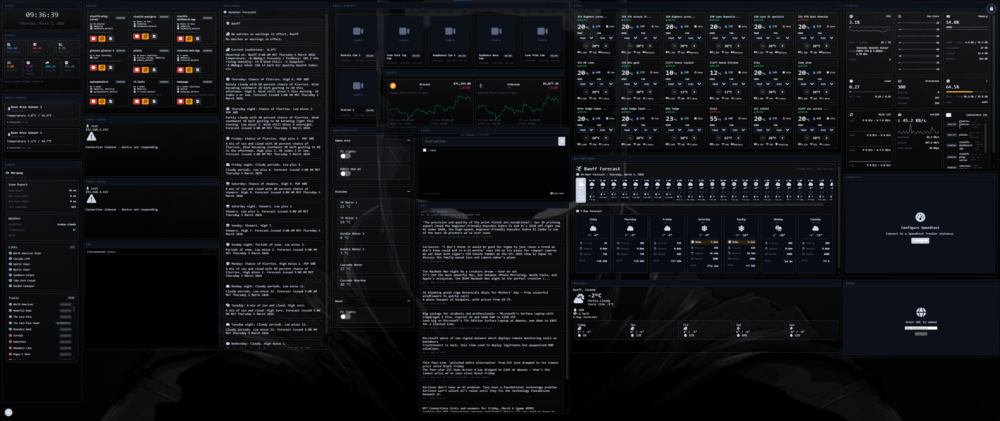

# Dashboard Theming Guide

Complete guide to customizing colors, themes, and styles in the dashboard.

## Table of Contents

- [Overview](#overview)
- [Design Tokens](#design-tokens)
- [Built-in Themes](#built-in-themes)
- [Custom Colors](#custom-colors)
- [Creating New Themes](#creating-new-themes)
- [Widget Styling](#widget-styling)
- [Background Patterns](#background-patterns)
- [Accessibility](#accessibility)
- [Best Practices](#best-practices)

## Overview

The dashboard uses **CSS Custom Properties** (CSS variables) for theming, allowing real-time theme switching without page reloads. All colors, spacing, and visual properties are defined as design tokens in [src/css/app.css](../src/css/app.css).

### Quick Start

**Try all themes instantly:**

1. Open your dashboard
2. Click the **theme button** (🎨) in the bottom-left controls menu
3. Cycle through: Light → Dark → Gruvbox → Tokyo Night → Catppuccin → System

Your preference is saved automatically!

### Key Features

- **Dynamic theme switching** - Light, dark, and system preference
- **System theme detection** - Respects OS dark mode preference
- **Persistent preferences** - Theme choice saved per user
- **Accessibility-first** - WCAG AA compliant contrast ratios
- **Reduced motion support** - Respects user motion preferences
- **15 Built-in themes** - Light, Dark, Gruvbox, Tokyo Night, Catppuccin, Forest, Sunset, Peachy, Stealth, Tactical, Futurist, Retro, Ethereal, Medieval, and System auto-detect

## Theme Quick Reference

| Theme | Background | Accent | Mood | Best For |
|-------|------------|--------|------|----------|
| **Light** | `#f5f5f5` | `#0066cc` Blue | Bright, Clean | Daytime work, bright environments |
| **Dark** | `#1a1a1a` | `#4da6ff` Blue | Cool, Modern | Night work, reduced eye strain |
| **Gruvbox** | `#282828` | `#fe8019` Orange | Warm, Retro | Coding, nostalgic aesthetic |
| **Tokyo Night** | `#1a1b26` | `#7aa2f7` Blue | Sleek, Cyberpunk | Modern work, focused sessions |
| **Catppuccin** | `#1e1e2e` | `#cba6f7` Lavender | Soft, Cozy | Creative work, extended use |
| **Forest** | `#1e2d1e` | `#4ade80` Green | Natural, Calm | Long sessions, outdoor themes |
| **Sunset** | `#2d1e1e` | `#fb923c` Orange | Warm, Relaxing | Evening work, creative tasks |
| **Peachy** | `#2d221e` | `#fda4af` Pink | Soft, Playful | Creative work, casual use |
| **Stealth** | `#0a0a0a` | `#666666` Gray | Minimalist, Focused | Distraction-free, tactical |
| **Tactical** | `#1a1d1a` | `#a3e635` Lime | Military, Sharp | Command center, operations |
| **Futurist** | `#0f1419` | `#00d9ff` Cyan | Tech, Sci-fi | Modern interfaces, futuristic |
| **Retro** | `#2b1b17` | `#f0b429` Amber | Vintage, Nostalgic | Classic terminal, retro computing |
| **Ethereal** | `#e8ebf7` | `#a78bfa` Lavender | Dreamy, Soft | Creative work, calm sessions |
| **Medieval** | `#4a3c2e` | `#d4a574` Gold | Fantasy, Earthy | RPG themes, unique dashboards |
| **System** | Auto | Auto | Adaptive | Follows OS preference |

## Design Tokens

All theming is controlled through CSS custom properties defined in the `:root` selector.

### Location

All design tokens are defined in: [src/css/app.css](../src/css/app.css)

```css
:root {
  /* Colors */
  --bg: #f5f5f5;
  --surface: #ffffff;
  --text: #1a1a1a;
  --muted: #666666;
  --accent: #0066cc;
  --ring: #0066cc;
  --shadow: rgba(0, 0, 0, 0.1);
  --border: #e0e0e0;
  --hover: #f0f0f0;

  /* Layout */
  --grid-size: 8px;
  --radius: 8px;
  --transition: 150ms;

  /* Z-index layers */
  --z-widget: 1;
  --z-selected: 100;
  --z-toolbar: 200;
  --z-fab: 300;
  --z-modal: 400;
}
```

### Token Categories

#### Color Tokens

| Token | Usage | Light Default | Dark Default |
|-------|-------|---------------|--------------|
| `--bg` | Canvas background | `#f5f5f5` | `#1a1a1a` |
| `--surface` | Widget/modal surfaces | `#ffffff` | `#2a2a2a` |
| `--text` | Primary text | `#1a1a1a` | `#f5f5f5` |
| `--muted` | Secondary text | `#666666` | `#999999` |
| `--accent` | Interactive elements | `#0066cc` | `#4da6ff` |
| `--ring` | Focus indicators | `#0066cc` | `#4da6ff` |
| `--shadow` | Drop shadows | `rgba(0,0,0,0.1)` | `rgba(0,0,0,0.3)` |
| `--border` | Borders and dividers | `#e0e0e0` | `#404040` |
| `--hover` | Hover states | `#f0f0f0` | `#333333` |

#### Layout Tokens

| Token | Usage | Default |
|-------|-------|---------|
| `--grid-size` | Grid snap size | `8px` |
| `--radius` | Border radius | `8px` |
| `--transition` | Animation duration | `150ms` |

#### Z-Index Layers

| Token | Usage | Value |
|-------|-------|-------|
| `--z-widget` | Widgets | `1` |
| `--z-selected` | Selected widget | `9999` |
| `--z-toolbar` | Toolbars/menus | `10000` |
| `--z-fab` | Floating action buttons | `10100` |
| `--z-modal` | Modals and overlays | `100000` |

## Built-in Themes

### Light Theme (Default)

Clean, bright interface for well-lit environments.

```css
:root {
  --bg: #f5f5f5;
  --surface: #ffffff;
  --text: #1a1a1a;
  --muted: #666666;
  --accent: #0066cc;
  --ring: #0066cc;
  --shadow: rgba(0, 0, 0, 0.1);
  --border: #e0e0e0;
  --hover: #f0f0f0;
}
```

### Dark Theme

Reduced eye strain for low-light environments.

```css
.theme-dark {
  --bg: #1a1a1a;
  --surface: #2a2a2a;
  --text: #f5f5f5;
  --muted: #999999;
  --accent: #4da6ff;
  --ring: #4da6ff;
  --shadow: rgba(0, 0, 0, 0.3);
  --border: #404040;
  --hover: #333333;
}
```

### System Theme (Auto)

Automatically matches OS dark mode preference:

```css
@media (prefers-color-scheme: dark) {
  :root:not(.theme-light) {
    /* Dark theme tokens */
  }
}
```

### Gruvbox Dark Theme

Warm retro theme with earthy tones and vibrant orange accents. Inspired by the popular Gruvbox color scheme beloved by developers for its warm, nostalgic aesthetic.

**Features:**
- Warm brown background reduces eye strain
- High-contrast text for readability
- Orange accent for energetic highlights
- Perfect for long coding sessions

```css
.theme-gruvbox {
  --bg: #282828;
  --surface: #3c3836;
  --text: #ebdbb2;
  --muted: #a89984;
  --accent: #fe8019;
  --ring: #fe8019;
  --shadow: rgba(0, 0, 0, 0.4);
  --border: #504945;
  --hover: #504945;
}
```

**Use Cases:** Development environments, late-night work, retro aesthetic preference.

### Tokyo Night Theme

Cool purple and blue night theme with a modern, sleek appearance. Inspired by the popular Tokyo Night VS Code theme.

**Features:**
- Deep blue background for calm focus
- Purple undertones for modern aesthetic
- Blue accent for professional appearance
- Excellent contrast ratios

```css
.theme-tokyo-night {
  --bg: #1a1b26;
  --surface: #24283b;
  --text: #c0caf5;
  --muted: #9aa5ce;
  --accent: #7aa2f7;
  --ring: #7aa2f7;
  --shadow: rgba(0, 0, 0, 0.5);
  --border: #414868;
  --hover: #2f3549;
}
```

**Use Cases:** Night work, modern aesthetics, cyberpunk vibes, focused work sessions.

### Catppuccin Mocha Theme

Soft pastel theme with gentle lavender accents and a warm, cozy atmosphere. Part of the popular Catppuccin color palette.

**Features:**
- Soft pastel colors reduce harshness
- Lavender accent for subtle elegance
- Balanced contrast for comfort
- Community-favorite palette

```css
.theme-catppuccin {
  --bg: #1e1e2e;
  --surface: #313244;
  --text: #cdd6f4;
  --muted: #a6adc8;
  --accent: #cba6f7;
  --ring: #cba6f7;
  --shadow: rgba(0, 0, 0, 0.4);
  --border: #45475a;
  --hover: #45475a;
}
```

**Use Cases:** Creative work, comfortable extended use, aesthetic dashboards, personal projects.

### Forest Theme

Natural green theme with calming tones. Perfect for long work sessions.

```css
.theme-forest {
  --bg: #1e2d1e;
  --surface: #2a3c2a;
  --text: #d4e8d4;
  --muted: #8aaa8a;
  --accent: #4ade80;
  --ring: #4ade80;
  --shadow: rgba(0, 0, 0, 0.4);
  --border: #3a4f3a;
  --hover: #344834;
}
```

**Use Cases:** Long sessions, nature-inspired themes, outdoor monitoring.

### Sunset Theme

Warm reddish tones with a relaxing, evening atmosphere.

```css
.theme-sunset {
  --bg: #2d1e1e;
  --surface: #3c2a2a;
  --text: #e8d4d4;
  --muted: #aa8a8a;
  --accent: #fb923c;
  --ring: #fb923c;
  --shadow: rgba(0, 0, 0, 0.4);
  --border: #4f3a3a;
  --hover: #483434;
}
```

**Use Cases:** Evening work, warm aesthetic, creative tasks.

### Peachy Theme

Soft, warm tones with playful pink accents.

```css
.theme-peachy {
  --bg: #2d221e;
  --surface: #3c302a;
  --text: #e8ddd4;
  --muted: #aa9a8a;
  --accent: #fda4af;
  --ring: #fda4af;
  --shadow: rgba(0, 0, 0, 0.4);
  --border: #4f433a;
  --hover: #483c34;
}
```

**Use Cases:** Creative work, casual use, playful aesthetic.

### Stealth Theme

Ultra-minimal monochrome theme. All grayscale for maximum focus.

```css
.theme-stealth {
  --bg: #0a0a0a;
  --surface: #1a1a1a;
  --text: #cccccc;
  --muted: #888888;
  --accent: #666666;
  --ring: #666666;
  --shadow: rgba(0, 0, 0, 0.5);
  --border: #333333;
  --hover: #2a2a2a;
}
```

**Use Cases:** Distraction-free work, tactical displays, minimalist preference.

### Tactical Theme

Military-inspired with sharp lime green accents on a dark olive background.

```css
.theme-tactical {
  --bg: #1a1d1a;
  --surface: #2a2d2a;
  --text: #d4e8d4;
  --muted: #8aaa8a;
  --accent: #a3e635;
  --ring: #a3e635;
  --shadow: rgba(0, 0, 0, 0.4);
  --border: #3a3f3a;
  --hover: #344834;
}
```

**Use Cases:** Command center operations, monitoring walls, military aesthetic.

### Futurist Theme

Sci-fi inspired with bright cyan accents on a deep dark background.

```css
.theme-futurist {
  --bg: #0f1419;
  --surface: #1a2029;
  --text: #c0d0e8;
  --muted: #8899aa;
  --accent: #00d9ff;
  --ring: #00d9ff;
  --shadow: rgba(0, 0, 0, 0.5);
  --border: #2a3040;
  --hover: #232a35;
}
```

**Use Cases:** Modern interfaces, futuristic dashboards, tech-forward aesthetics.

### Retro Theme

Vintage amber on dark brown, inspired by classic CRT terminals.

```css
.theme-retro {
  --bg: #2b1b17;
  --surface: #3c2b25;
  --text: #e8d8c4;
  --muted: #aa9880;
  --accent: #f0b429;
  --ring: #f0b429;
  --shadow: rgba(0, 0, 0, 0.5);
  --border: #4f3f35;
  --hover: #483830;
}
```

**Use Cases:** Classic terminal aesthetic, retro computing, nostalgic vibes.

### Ethereal Theme

Dreamy pastel palette with soft purples and blues. A light theme with a mystical feel.

```css
.theme-ethereal {
  --bg: #e8ebf7;
  --surface: #f0f3ff;
  --text: #4a4a6e;
  --muted: #8b8ba8;
  --accent: #a78bfa;
  --ring: #c4b5fd;
  --shadow: rgba(167, 139, 250, 0.2);
  --border: #d8d8f0;
  --hover: #f5f6ff;
}
```

**Features:**
- Soft pastel light theme with dreamy purple accents
- Backdrop-filter blur effects on widgets for a floating feel
- Rounded, airy aesthetic with custom font suggestions (Quicksand, Comfortaa, Nunito)

**Use Cases:** Creative work, calm sessions, light-mode preference with personality.

### Medieval Theme

Fantasy RPG palette with earthy browns and warm gold accents. Uses serif fonts for a storybook feel.

```css
.theme-medieval {
  --bg: #4a3c2e;
  --surface: #5e5040;
  --text: #f0e8d8;
  --muted: #b8a890;
  --accent: #d4a574;
  --ring: #d4a574;
  --shadow: rgba(0, 0, 0, 0.5);
  --border: #6a5a48;
  --hover: #6e6050;
}
```

**Features:**
- Earthy brown tones with warm gold accents
- Text shadows for a textured, old-world appearance
- Serif font family (Cinzel, Trajan Pro, Georgia) for thematic consistency
- Heavy borders giving widgets a parchment-card look

**Use Cases:** RPG-themed dashboards, unique aesthetics, fantasy-inspired personal pages.

### Switching Between Themes

Click the theme button in the bottom-left controls menu to cycle through all available themes:

**Theme Rotation:**
1. Light (default)
2. Dark
3. Gruvbox
4. Tokyo Night
5. Catppuccin
6. Forest
7. Sunset
8. Peachy
9. Stealth
10. Tactical
11. Futurist
12. Retro
13. Ethereal
14. Medieval
15. System (auto)

Your theme preference is saved automatically and persists across sessions.

## Custom Colors

### Changing Accent Color

The accent color is used for:
- Primary buttons
- Focus indicators
- Links and interactive elements
- Selected widget borders

**Example: Blue to Purple**

```css
:root {
  --accent: #7c3aed; /* Purple */
  --ring: #7c3aed;
}

.theme-dark {
  --accent: #a78bfa; /* Lighter purple for dark mode */
  --ring: #a78bfa;
}
```

**Example: Material Design Colors**

```css
/* Material Blue */
:root {
  --accent: #2196F3;
  --ring: #2196F3;
}

/* Material Green */
:root {
  --accent: #4CAF50;
  --ring: #4CAF50;
}

/* Material Orange */
:root {
  --accent: #FF9800;
  --ring: #FF9800;
}
```

### Changing Background Colors

**Example: Pure Black Dark Mode (OLED)**

```css
.theme-dark {
  --bg: #000000;
  --surface: #121212;
  --border: #2a2a2a;
}
```

**Example: Warm Light Theme**

```css
:root {
  --bg: #faf8f5;
  --surface: #ffffff;
  --border: #e8e4df;
  --hover: #f5f1ec;
}
```

## Creating New Themes

### Method 1: CSS Class-Based Themes

Create a new theme by adding a class to [src/css/app.css](../src/css/app.css):

```css
.theme-solarized-light {
  --bg: #fdf6e3;
  --surface: #eee8d5;
  --text: #657b83;
  --muted: #93a1a1;
  --accent: #268bd2;
  --ring: #268bd2;
  --shadow: rgba(0, 0, 0, 0.07);
  --border: #d3cbb7;
  --hover: #e3dcc3;
}

.theme-nord {
  --bg: #2e3440;
  --surface: #3b4252;
  --text: #eceff4;
  --muted: #d8dee9;
  --accent: #88c0d0;
  --ring: #88c0d0;
  --shadow: rgba(0, 0, 0, 0.4);
  --border: #4c566a;
  --hover: #434c5e;
}

.theme-dracula {
  --bg: #282a36;
  --surface: #44475a;
  --text: #f8f8f2;
  --muted: #6272a4;
  --accent: #bd93f9;
  --ring: #bd93f9;
  --shadow: rgba(0, 0, 0, 0.5);
  --border: #6272a4;
  --hover: #44475a;
}
```

### Method 2: Dynamic Theme Injection

For programmatically generating themes:

```javascript
// In src/main.ts or theme manager
function applyCustomTheme(colors) {
  const root = document.documentElement;
  Object.entries(colors).forEach(([key, value]) => {
    root.style.setProperty(`--${key}`, value);
  });
}

// Usage
applyCustomTheme({
  bg: '#1e1e2e',
  surface: '#313244',
  text: '#cdd6f4',
  accent: '#89b4fa',
  // ... more colors
});
```

### Integrating Theme Selector

To add your custom theme to the theme switcher, modify [src/main.ts](../src/main.ts):

```typescript
// Find the theme button handler
themeBtn.addEventListener('click', () => {
  const themes = ['theme-light', 'theme-dark', 'theme-nord', 'theme-solarized'];
  const currentTheme = localStorage.getItem('theme') || 'theme-light';
  const currentIndex = themes.indexOf(currentTheme);
  const nextTheme = themes[(currentIndex + 1) % themes.length];
  
  document.body.className = nextTheme;
  localStorage.setItem('theme', nextTheme);
});
```

## Widget Styling

### Widget-Specific Overrides

Widgets can have custom styling while respecting global theme:

```css
/* Gmail Widget Example */
.gmail-message-unread {
  background: rgba(66, 133, 244, 0.05);
  border-left: 3px solid var(--accent);
}

/* Docker Widget */
.docker-container-card {
  background: var(--bg);
  border: 1px solid var(--border);
}

.badge.running {
  background: #4CAF5022;
  color: #4CAF50;
}
```

### Status Colors

Status colors should work across all themes:

```css
/* Success - Green */
.badge-success,
.success {
  background: #4CAF5022;
  color: #4CAF50;
}

/* Warning - Orange */
.badge-warning,
.warning {
  background: #FF980022;
  color: #FF9800;
}

/* Danger - Red */
.badge-danger,
.error {
  background: #cf332822;
  color: #cf3328;
}

/* Info - Blue */
.badge-info {
  background: #2196F322;
  color: #2196F3;
}
```

### Widget Card Pattern

Standard widget card styling:

```css
.card {
  background: rgba(14, 13, 13, 0.25);
  border: 1px solid var(--border);
  border-radius: 8px;
  padding: 12px;
  transition: all 0.2s;
}

.card:hover {
  transform: translateY(-2px);
  box-shadow: 0 4px 12px var(--shadow);
}
```

## Backgrounds

The dashboard supports both built-in patterns and custom backgrounds (images and videos). 

### Built-in Patterns

The canvas supports different background patterns defined in [src/css/app.css](../src/css/app.css):

#### Grid Pattern (Default)

```css
.canvas[data-background="grid"] {
  background-image:
    linear-gradient(var(--border) 1px, transparent 1px),
    linear-gradient(90deg, var(--border) 1px, transparent 1px);
  background-size: var(--grid-size) var(--grid-size);
}
```

#### Dots Pattern

```css
.canvas[data-background="dots"] {
  background-image: radial-gradient(circle, var(--border) 1px, transparent 1px);
  background-size: calc(var(--grid-size) * 2) calc(var(--grid-size) * 2);
}
```

#### Lines Pattern

```css
.canvas[data-background="lines"] {
  background-image: linear-gradient(var(--border) 1px, transparent 1px);
  background-size: 100% calc(var(--grid-size) * 4);
}
```

#### Solid (No Pattern)

```css
.canvas[data-background="solid"] {
  background-image: none;
}
```

### Custom Backgrounds

In addition to built-in patterns, you can use custom images or videos as backgrounds.

#### Image Backgrounds

Support for static images including:
- Standard formats: JPEG, PNG, GIF, WebP
- Animated GIFs
- URL-based or uploaded files

**Features:**
- **Opacity Control** (0-100%): Adjust transparency for better widget visibility
- **Blur Effect** (0-10px): Add blur to reduce distraction
- **Brightness** (0-200%): Lighten or darken the background
- **Fit Mode**: Choose between Cover, Contain, or Fill

**Usage:**
1. Open background settings from the toolbar
2. Select "Image" pattern
3. Enter a URL or upload an image file
4. Adjust display settings as needed
5. Click "Apply Background"

**Example URLs:**
```
https://example.com/background.jpg
https://example.com/animated-pattern.gif
data:image/png;base64,... (base64 encoded)
```

#### Video Backgrounds

Support for animated video backgrounds:
- Supported formats: MP4, WebM. Check out [https://motionbgs.com/](https://motionbgs.com/) for exmples of back ground videos you could use.
- Autoplay with loop option
- Muted by default (recommended)
- Playback speed control

**Features:**
- **All Image Settings**: Opacity, blur, brightness, and fit mode
- **Playback Speed** (0.25x-2x): Control animation speed
- **Loop**: Enable/disable continuous playback
- **Muted**: Keep videos silent to reduce memory usage

**Usage:**
1. Open background settings from the toolbar
2. Select "Video" pattern
3. Enter a video URL (upload not recommended for large files)
4. Adjust display and video settings
5. Click "Apply Background"

**Example URLs:**
```
https://example.com/background.mp4
https://motionbgs.com/media/9045/subtle-animation.960x540.mp4
```

**Performance Notes:**
- Video backgrounds consume more memory than images or patterns
- Use lower resolution videos (720p or less) for better performance
- Keep videos muted to reduce processing overhead
- Consider using animated GIFs for simpler animations
- Videos are automatically cleaned up when switching backgrounds

### Accessing Background Settings

Click the background button (grid icon) in the toolbar to open the Background Settings dialog where you can:
- Select pattern type (Grid, Dots, Lines, Solid, Image, Video)
- Configure custom backgrounds with URL or file upload
- Adjust display settings (opacity, blur, brightness, fit)
- Configure video-specific options (playback speed, loop, muted)
- Preview changes before applying
- Reset to default grid pattern

### Custom Background Patterns (CSS)

Add new patterns by extending the pattern system:

```css
.canvas[data-background="diagonal"] {
  background-image: repeating-linear-gradient(
    45deg,
    transparent,
    transparent 10px,
    var(--border) 10px,
    var(--border) 11px
  );
}

.canvas[data-background="hexagon"] {
  background-image: 
    radial-gradient(circle at 50% 0, transparent 24%, var(--border) 25%, var(--border) 26%, transparent 27%),
    radial-gradient(circle at 0 50%, transparent 24%, var(--border) 25%, var(--border) 26%, transparent 27%);
  background-size: 40px 40px;
}
```

## Accessibility

### Contrast Requirements

All themes must meet **WCAG AA** contrast ratios:
- Normal text: **4.5:1** minimum
- Large text (18pt+): **3:1** minimum
- UI components: **3:1** minimum

**Testing Contrast:**
```css
/* Good - 7.5:1 ratio */
--text: #1a1a1a;
--bg: #f5f5f5;

/* Good - 12.6:1 ratio */
--text: #000000;
--bg: #ffffff;

/* Bad - 2.1:1 ratio (fails AA) */
--text: #888888;
--bg: #ffffff;
```

**Tools for Testing:**
- [WebAIM Contrast Checker](https://webaim.org/resources/contrastchecker/)
- Chrome DevTools Lighthouse
- Firefox Accessibility Inspector

### Focus Indicators

Always maintain visible focus indicators:

```css
*:focus-visible {
  outline: 2px solid var(--ring);
  outline-offset: 2px;
}

button:focus-visible {
  outline: 2px solid var(--ring);
  outline-offset: 2px;
}
```

### Reduced Motion

Respect user motion preferences:

```css
@media (prefers-reduced-motion: reduce) {
  *,
  *::before,
  *::after {
    animation-duration: 0.01ms !important;
    animation-iteration-count: 1 !important;
    transition-duration: 0.01ms !important;
  }
}
```

## Best Practices

### 1. Use Semantic Colors

Don't use color-specific names in CSS classes:

```css
/* Bad */
.blue-button { background: blue; }
.red-text { color: red; }

/* Good */
.btn-primary { background: var(--accent); }
.error-text { color: var(--error); }
```

### 2. Test in Both Themes

Always test your changes in light and dark modes:

```bash
# Toggle theme in browser DevTools
document.body.classList.toggle('theme-dark');
```

### 3. Avoid Hardcoded Colors

Use design tokens instead of hardcoded values:

```css
/* Bad */
.widget {
  background: #ffffff;
  color: #000000;
  border: 1px solid #cccccc;
}

/* Good */
.widget {
  background: var(--surface);
  color: var(--text);
  border: 1px solid var(--border);
}
```

### 4. Test Accessibility

Run accessibility audits:

```bash
# Using Lighthouse in Chrome DevTools
Cmd/Ctrl + Shift + C → Lighthouse tab → Generate report
```

### 5. Maintain Consistency

Keep visual hierarchy consistent across themes:

```css
/* Primary actions should always be prominent */
.btn-primary {
  background: var(--accent);
  color: white;
  font-weight: bold;
}

/* Secondary actions should be subtle */
.btn-secondary {
  background: transparent;
  color: var(--text);
  border: 1px solid var(--border);
}
```

### 6. Alpha Transparency for Overlays

Use RGBA for semi-transparent overlays that adapt to any background:

```css
.modal-overlay {
  background: rgba(0, 0, 0, 0.5); /* Works in any theme */
}

/* Better - uses theme color with transparency */
.hover-state {
  background: rgba(var(--accent-rgb), 0.1);
}
```

### 7. Document Custom Properties

Comment your token choices:

```css
:root {
  /* Primary interactive color - used for buttons, links, focus */
  --accent: #0066cc;
  
  /* Surface color for cards and modals - must contrast with --bg */
  --surface: #ffffff;
  
  /* Border color - subtle but visible in both themes */
  --border: #e0e0e0;
}
```

## Advanced Theming

### Color Mode Utilities

Create utility classes for common patterns:

```css
/* Inverse colors */
.inverse {
  background: var(--text);
  color: var(--bg);
}

/* Subtle backgrounds */
.subtle-bg {
  background: var(--hover);
}

/* Emphasized borders */
.emphasized-border {
  border: 2px solid var(--accent);
}
```

### Dynamic Color Generation

For programmatic color manipulation:

```typescript
// Lighten/darken colors while respecting theme
function adjustColor(color: string, amount: number): string {
  // Implementation for color manipulation
  // Use HSL for better results across themes
}
```

### Per-Widget Theme Overrides

Allow widgets to define their own color schemes:

```typescript
interface WidgetTheme {
  primary: string;
  secondary: string;
  background: string;
}

// Widget can override default theme
const customTheme: WidgetTheme = {
  primary: '#ff6b6b',
  secondary: '#4ecdc4',
  background: 'rgba(255, 107, 107, 0.1)'
};
```

## Examples

### All Built-in Themes - Color Palette Comparison

Complete color token breakdown for all six built-in themes:

| Token | Light | Dark | Gruvbox | Tokyo Night | Catppuccin |
|-------|-------|------|---------|-------------|------------|
| `--bg` | `#f5f5f5` | `#1a1a1a` | `#282828` | `#1a1b26` | `#1e1e2e` |
| `--surface` | `#ffffff` | `#2a2a2a` | `#3c3836` | `#24283b` | `#313244` |
| `--text` | `#1a1a1a` | `#f5f5f5` | `#ebdbb2` | `#c0caf5` | `#cdd6f4` |
| `--muted` | `#666666` | `#999999` | `#a89984` | `#9aa5ce` | `#a6adc8` |
| `--accent` | `#0066cc` | `#4da6ff` | `#fe8019` | `#7aa2f7` | `#cba6f7` |
| `--ring` | `#0066cc` | `#4da6ff` | `#fe8019` | `#7aa2f7` | `#cba6f7` |
| `--border` | `#e0e0e0` | `#404040` | `#504945` | `#414868` | `#45475a` |
| `--hover` | `#f0f0f0` | `#333333` | `#504945` | `#2f3549` | `#45475a` |

**Color Families:**
- **Light & Dark** → Blue accent (professional, trustworthy)
- **Gruvbox** → Orange accent (energetic, warm)
- **Tokyo Night** → Blue accent (cool, modern)
- **Catppuccin** → Lavender accent (soft, creative)

### Complete Custom Theme

```css
/* Cyberpunk Theme */
.theme-cyberpunk {
  --bg: #0a0e27;
  --surface: #141937;
  --text: #00f0ff;
  --muted: #7b8cde;
  --accent: #ff006e;
  --ring: #ff006e;
  --shadow: rgba(255, 0, 110, 0.3);
  --border: #3d2c8d;
  --hover: #1f1e3d;
}

/* Nature Theme */
.theme-nature {
  --bg: #f0f4f0;
  --surface: #ffffff;
  --text: #2d3a2e;
  --muted: #5c6d5b;
  --accent: #4a9b54;
  --ring: #4a9b54;
  --shadow: rgba(74, 155, 84, 0.15);
  --border: #d1ded2;
  --hover: #e8f0e9;
}

/* High Contrast (Accessibility) */
.theme-high-contrast {
  --bg: #000000;
  --surface: #000000;
  --text: #ffffff;
  --muted: #cccccc;
  --accent: #ffff00;
  --ring: #ffff00;
  --shadow: rgba(255, 255, 255, 0.3);
  --border: #ffffff;
  --hover: #333333;
}
```

## Resources

- [CSS Custom Properties (MDN)](https://developer.mozilla.org/en-US/docs/Web/CSS/Using_CSS_custom_properties)
- [WCAG Contrast Guidelines](https://www.w3.org/WAI/WCAG21/Understanding/contrast-minimum.html)
- [Material Design Color System](https://material.io/design/color/the-color-system.html)
- [Color Contrast Checker](https://webaim.org/resources/contrastchecker/)
- [prefers-color-scheme (MDN)](https://developer.mozilla.org/en-US/docs/Web/CSS/@media/prefers-color-scheme)

## Troubleshooting

### Theme Not Applying

1. Check browser DevTools for CSS errors
2. Verify class name matches CSS selector
3. Clear browser cache: `Ctrl+Shift+R` / `Cmd+Shift+R`
4. Check localStorage for saved theme preference

### Contrast Issues

1. Use contrast checker tools
2. Test with WCAG AA guidelines (4.5:1 for text)
3. Increase color difference between text and background
4. Consider using high contrast mode for testing

### Flash of Unstyled Content

Add theme class to HTML before page renders:

```html
<html class="theme-dark">
  <!-- Prevents flash of wrong theme -->
</html>
```

```javascript
// Apply saved theme immediately
const savedTheme = localStorage.getItem('theme') || 'theme-light';
document.documentElement.className = savedTheme;
```

---

## Contributing

When adding new components or widgets:

1. Use design tokens, not hardcoded colors
2. Test in both light and dark themes
3. Verify contrast ratios meet WCAG AA
4. Support prefers-reduced-motion
5. Document any new tokens added

---

**Need Help?** See [README.md](./README.md) or file an issue on GitHub.
